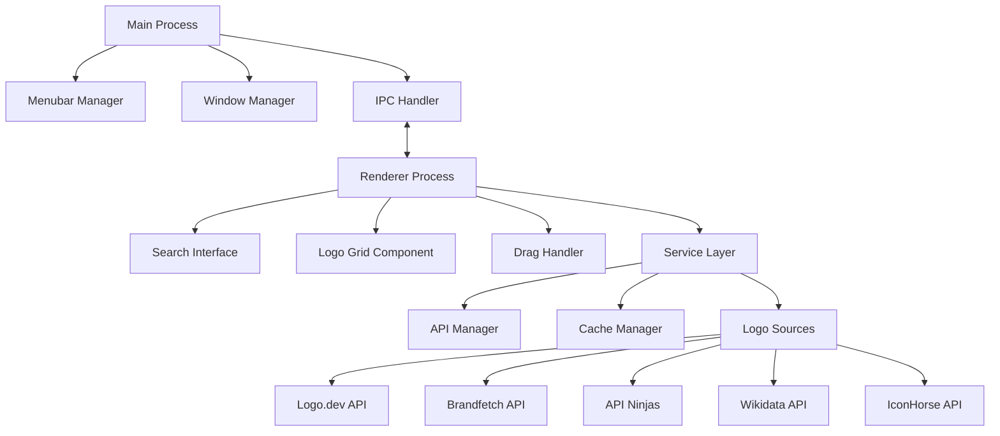

# Design Document

## Overview

LogoBuddy is a native macOS menubar application built using Electron with native macOS integrations. The app provides a glassmorphic popover interface for searching and retrieving company logos from multiple API sources. The architecture emphasizes performance through local caching, seamless drag-and-drop functionality, and a modern UI that adapts to system appearance preferences.

The application follows a modular architecture with clear separation between the main process (menubar management), renderer process (UI), and service layer (API integrations and caching).

## Architecture

### High-Level Architecture



### Technology Stack

- **Framework**: Electron 28+ for cross-platform desktop app with native macOS integrations
- **UI Framework**: React 18 with TypeScript for component-based UI
- **Styling**: CSS-in-JS with styled-components for glassmorphic design
- **State Management**: Zustand for lightweight state management
- **HTTP Client**: Axios with retry logic and timeout handling
- **Caching**: SQLite with better-sqlite3 for local logo cache
- **Drag & Drop**: Native HTML5 drag API with Electron file handling
- **Build System**: Vite for fast development and optimized builds

## Components and Interfaces

### Main Process Components

#### MenubarManager
```typescript
interface MenubarManager {
  createTray(): void;
  showPopover(): void;
  hidePopover(): void;
  positionWindow(): void;
  handleSystemAppearanceChange(): void;
}
```

Responsibilities:
- Create and manage the menubar tray icon
- Handle tray icon clicks and show/hide popover
- Position popover window relative to menubar icon
- Listen for system appearance changes (light/dark mode)

#### WindowManager
```typescript
interface WindowManager {
  createPopoverWindow(): BrowserWindow;
  showWindow(): void;
  hideWindow(): void;
  setWindowBounds(bounds: Rectangle): void;
}
```

Responsibilities:
- Create the popover window with appropriate styling
- Manage window visibility and positioning
- Handle window focus/blur events for auto-hide behavior

### Renderer Process Components

#### SearchInterface
```typescript
interface SearchInterfaceProps {
  onSearch: (query: string) => void;
  isLoading: boolean;
  placeholder: string;
}
```

Responsibilities:
- Render the search input field with glassmorphic styling
- Handle user input and trigger search operations
- Extract company names from pasted domain URLs
- Show loading states during search operations

#### LogoGrid
```typescript
interface LogoGridProps {
  logos: LogoResult[];
  onDragStart: (logo: LogoResult) => void;
  onContextMenu: (logo: LogoResult, event: MouseEvent) => void;
}

interface LogoResult {
  id: string;
  url: string;
  source: string;
  format: string;
  size: { width: number; height: number };
  transparent: boolean;
}
```

Responsibilities:
- Display logo results in a responsive grid layout
- Handle drag operations for each logo
- Show context menus on right-click
- Provide visual feedback for hover and drag states

#### DragHandler
```typescript
interface DragHandler {
  initiateDrag(logo: LogoResult, event: DragEvent): void;
  handleDragEnd(): void;
  copyToClipboard(logo: LogoResult): Promise<void>;
  saveToFile(logo: LogoResult): Promise<void>;
}
```

Responsibilities:
- Manage drag-and-drop operations with external applications
- Handle clipboard operations for logo copying
- Manage file save operations with native dialogs

### Service Layer Components

#### APIManager
```typescript
interface APIManager {
  searchLogos(query: string): Promise<LogoResult[]>;
  searchSource(source: LogoSource, query: string): Promise<LogoResult[]>;
  validateLogoUrl(url: string): Promise<boolean>;
}

enum LogoSource {
  LOGO_DEV = 'logo.dev',
  BRANDFETCH = 'brandfetch',
  API_NINJAS = 'api-ninjas',
  WIKIDATA = 'wikidata',
  ICONHORSE = 'iconhorse'
}
```

Responsibilities:
- Coordinate searches across multiple logo sources
- Handle API rate limiting and error recovery
- Validate logo URLs and formats
- Aggregate and deduplicate results from multiple sources

#### CacheManager
```typescript
interface CacheManager {
  getCachedResults(query: string): Promise<LogoResult[] | null>;
  cacheResults(query: string, results: LogoResult[]): Promise<void>;
  downloadAndCacheImage(url: string): Promise<string>;
  cleanupExpiredCache(): Promise<void>;
}
```

Responsibilities:
- Manage SQLite database for search result caching
- Download and cache logo images locally
- Implement cache expiration and cleanup policies
- Provide fast access to previously searched logos

## Data Models

### Logo Result Model
```typescript
interface LogoResult {
  id: string;                    // Unique identifier
  url: string;                   // Original logo URL
  localPath?: string;            // Local cached file path
  source: LogoSource;            // API source that provided the logo
  format: 'png' | 'svg' | 'jpg'; // Image format
  size: {
    width: number;
    height: number;
  };
  transparent: boolean;          // Whether logo has transparent background
  quality: 'high' | 'medium' | 'low'; // Quality assessment
  companyName: string;           // Associated company name
  createdAt: Date;              // Cache timestamp
}
```

### Search Cache Model
```typescript
interface SearchCache {
  id: string;
  query: string;                 // Search query
  results: LogoResult[];         // Cached results
  createdAt: Date;              // Cache creation time
  expiresAt: Date;              // Cache expiration time
  sources: LogoSource[];        // Sources that were searched
}
```

### App Configuration Model
```typescript
interface AppConfig {
  apiKeys: {
    brandfetch?: string;
    apiNinjas?: string;
  };
  cache: {
    maxSize: number;             // Max cache size in MB
    expirationDays: number;      // Days before cache expires
  };
  ui: {
    theme: 'auto' | 'light' | 'dark';
    accentColor: string;
    gridColumns: number;
  };
}
```

## Error Handling

### API Error Handling
- **Network Errors**: Implement exponential backoff retry logic with maximum 3 attempts
- **Rate Limiting**: Respect API rate limits and implement queuing for requests
- **Invalid Responses**: Validate API responses and filter out invalid logo URLs
- **Timeout Handling**: Set 10-second timeout for API requests with graceful fallback

### Cache Error Handling
- **Database Errors**: Implement fallback to in-memory cache if SQLite fails
- **Disk Space**: Monitor available disk space and clean cache when space is low
- **Corrupted Cache**: Detect and rebuild corrupted cache entries automatically

### UI Error Handling
- **No Results**: Display helpful message with suggestions for refining search
- **Loading Failures**: Show retry options for failed logo loads
- **Drag Failures**: Provide feedback when drag operations fail
- **Network Offline**: Detect offline state and show cached results only

## Testing Strategy

### Unit Testing
- **API Services**: Mock HTTP requests and test response parsing
- **Cache Manager**: Test SQLite operations and cache policies
- **Logo Processing**: Test image validation and format detection
- **Search Logic**: Test query parsing and result aggregation

### Integration Testing
- **API Integration**: Test actual API calls with rate limiting
- **Cache Integration**: Test end-to-end caching workflow
- **Drag & Drop**: Test file creation and drag operations
- **Window Management**: Test popover positioning and behavior

### End-to-End Testing
- **Search Workflow**: Test complete search-to-drag workflow
- **Multi-source Search**: Test searching across all logo sources
- **Cache Performance**: Test cache hit/miss scenarios
- **System Integration**: Test menubar integration and system appearance changes

### Performance Testing
- **Search Speed**: Measure search response times with caching
- **Memory Usage**: Monitor memory consumption during extended use
- **Cache Efficiency**: Test cache hit rates and storage efficiency
- **UI Responsiveness**: Ensure smooth animations and interactions

### Manual Testing Scenarios
- Test with popular company names (Apple, Google, Microsoft)
- Test with university names (Stanford, MIT, Harvard)
- Test with domain URLs (apple.com, google.com)
- Test drag-and-drop to various applications (PowerPoint, Figma, Finder)
- Test right-click context menu operations
- Test appearance changes between light and dark mode
- Test network connectivity changes (online/offline scenarios)