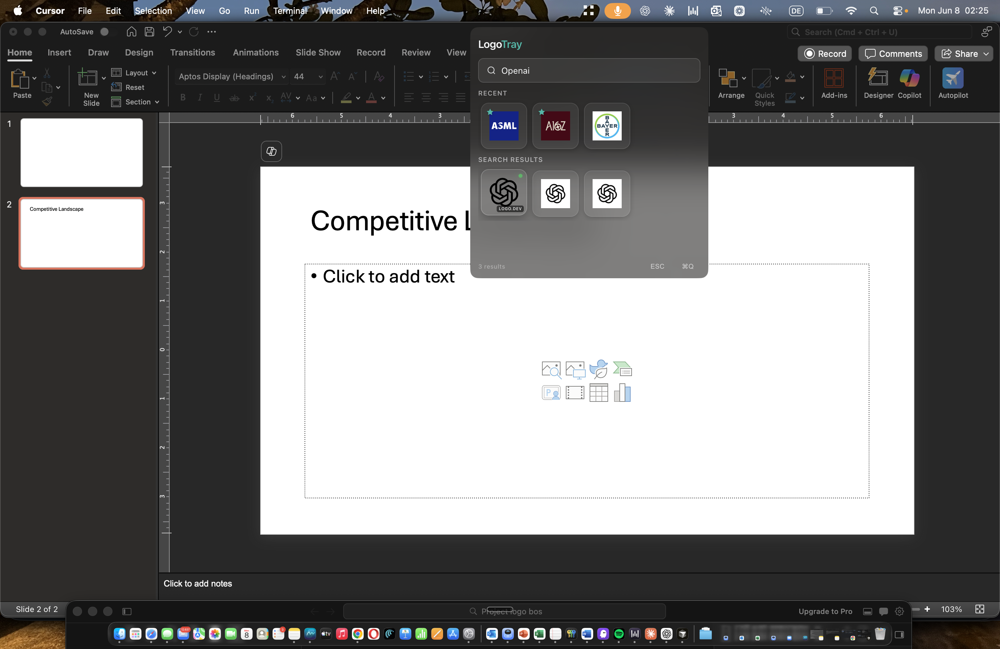

# LogoTray

A native macOS menu bar app that lets analysts search, preview, and drag company logos directly into PowerPoint, Keynote, and any other application — in seconds.

---

## Example Use Case

Anyone who builds presentation decks professionally knows the pain: you need 15 company logos for a competitive landscape slide and spend 45 minutes on Google, downloading images, removing backgrounds, resizing, and cleaning up files — before you've even placed a single logo.

LogoTray solves this entirely. It lives in your macOS menu bar and surfaces high-quality, transparent logos from multiple sources the moment you type a company name. You drag the logo directly into your slide. Done.

---

## Before LogoTray

Building a single competitive landscape slide the traditional way:

1. Open a browser and search "[Company] logo PNG transparent"
2. Scroll past SEO spam to find a usable image
3. Download the file, check the background, repeat if it's wrong
4. Open an editor to remove the background (if needed)
5. Import into PowerPoint, resize manually to match other logos
6. Repeat this 10–20 times per slide

A 10-logo market map takes 30–60 minutes of friction before any actual analysis begins.

---

## With LogoTray

1. Click the LogoTray icon in the macOS menu bar
2. Type the company name — results appear instantly
3. Drag the logo directly into PowerPoint, Keynote, Figma, or any app
4. Search the next company without leaving your slide

A 10-logo market map takes under 2 minutes.

---

## Screenshot



*Searching for OpenAI logos while working in PowerPoint — results are dragged directly onto the slide.*

---

## Who Uses This

LogoTray is built for professionals who regularly produce polished presentation decks:

| Team | Common Use Case |
|---|---|
| Investment Banking | Pitchbooks, competitive landscapes, sector overviews |
| Private Equity | Deal memos, portfolio company slides, IC presentations |
| Venture Capital | Market maps, startup ecosystem slides, LP reports |
| Management Consulting | Strategy decks, industry overviews, client presentations |
| Corporate Development | M&A target screens, integration presentations |
| Corporate Strategy | Competitive intelligence decks, board presentations |

---

## Typical Slide Types

- **Competitive landscape grids** — arrange logos of all competitors in a market
- **Market maps** — position companies across two axes by segment or capability
- **Industry overviews** — cover slides showing the key players in a space
- **M&A deal books** — target company profiles with logos and branding
- **Investment committee decks** — comps slides with peer company logos
- **Startup ecosystem maps** — visualize a category from seed to growth stage
- **Consulting strategy presentations** — vendor landscapes, partner ecosystems

---

## Features

- **Instant search** — results from Logo.dev, Brandfetch, and multiple other sources simultaneously
- **Drag and drop** — drag any logo directly into PowerPoint, Keynote, Figma, Notion, or any app
- **Recent logos** — your last 10 logos pinned at the top for quick re-use
- **Favorites** — star logos you use repeatedly
- **Multiple formats** — PNG with transparent background and SVG, ready to use at any size
- **Dark mode** — adapts to your system appearance automatically
- **Keyboard shortcuts** — `⌘K` to focus search, `ESC` to close, `⌘Q` to quit

---

## Keyboard Shortcuts

| Shortcut | Action |
|---|---|
| `ESC` | Hide window |
| `⌘Q` | Quit application |
| `⌘K` | Focus search input |
| `⌘⌫` | Clear search |
| `⌘⇧L` | Open LogoTray from anywhere |

---

## Development

### Prerequisites

- Node.js 18+
- npm

### Setup

```bash
npm install
npm start
```

See [SETUP.md](SETUP.md) for full setup instructions.

### Scripts

```bash
npm start          # Start development (Electron Forge)
npm run package    # Package the app
npm run make       # Build distributable
npm run lint       # Run ESLint
npm run format     # Format with Prettier
npm run type-check # TypeScript check
npm test           # Run tests
```

### Project Structure

```
src/
├── main/           # Electron main process
│   ├── main.ts     # Tray, window management, IPC
│   └── preload.ts  # Secure IPC bridge
├── renderer/       # React UI
│   ├── App.tsx     # Root component with search logic
│   └── components/ # LogoGrid, LogoCard, ContextMenu
└── services/
    ├── api/        # Logo.dev, Brandfetch, API Ninjas, Wikidata
    ├── cache/      # SQLite caching layer
    └── drag/       # Native drag and drop handler
```

---

## License

MIT
